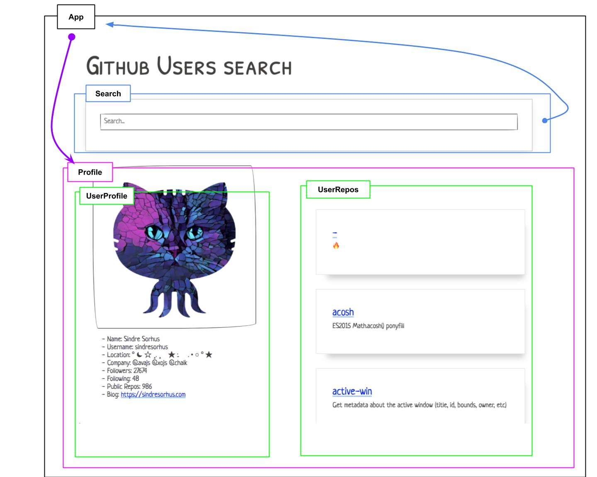

# V2

## Agenda:

1.  What is React
2.  What is TypeScript
3.  What are we gonna build ( explain architecture )
4.  Hands down, chin up!
5.  Recap and finish him!

## Links

- [Intro Slides](https://docs.google.com/presentation/d/e/2PACX-1vSu5B4Q-3qxcvsQ7HauMAqJmlpQr_cPCU69LnVZxIvl4nze6uhR3UzL8mHzFYnWlLoGOht5Ugz1lOhS/pub?start=false&loop=false&delayms=3000)
- [React + TS blogposts](https://medium.com/@martin_hotell/latest)
- [Building a company around TypeScript](https://medium.com/ionic-and-the-mobile-web/building-a-company-around-typescript-5301aaf42007)

## API types:

```ts
export interface GithubUserRepo {
  name: string
  html_url: string
  description: string
}

export interface GithubUser {
  login: string
  id: 1
  node_id: string
  avatar_url: string
  gravatar_id: string
  url: string
  html_url: string
  followers_url: string
  following_url: string
  gists_url: string
  starred_url: string
  subscriptions_url: string
  organizations_url: string
  repos_url: string
  events_url: string
  received_events_url: string
  type: string
  site_admin: false
  name: string
  company: string
  blog: string
  location: string
  email: string
  hireable: false
  bio: string
  public_repos: number
  public_gists: number
  followers: number
  following: number
  created_at: string
  updated_at: string
}
```

## Architecture



---

# Code session

## Phase 1

1.  start from scratch

`yarn init -y`

2.  install dependencies

```sh
yarn add react{,-dom} @types/react{,-dom}

yarn add -D typescript parcel-bundler
```

3.  initialize TypeScript

`yarn tsc --init --outDir dist --sourceMap --jsx react --module ESNext --lib dom,es2015 --moduleResolution node --forceConsistentCasingInFileNames --skipLibCheck`

And tweak config to:

```json
{
  "compilerOptions": {
    "target": "es5",
    "module": "es2015",
    "lib": ["dom", "es2015"],
    "jsx": "react",
    "sourceMap": true,
    "outDir": "./out-tsc",

    /* Strict Type-Checking Options */
    "strict": true,

    /* Module Resolution Options */
    "moduleResolution": "node",
    "esModuleInterop": true
  },
  "include": ["./src"]
}
```

4.  initialize code structure

```sh
mkdir src && touch src/{index.html,main.ts,styles.css}
```

**index.html**

```html
<!DOCTYPE html>
<html lang="en">

<head>
  <meta charset="UTF-8">
  <meta name="viewport" content="width=device-width, initial-scale=1.0">
  <meta http-equiv="X-UA-Compatible" content="ie=edge">
  <title>React + TS = ❤️</title>
</head>

<body>
  <div id="root"></div>
  <script src="./main.ts"></script>
</body>

</html>
```

**main.ts**

```ts
const bootstrap = () => {
  const mountTo = document.getElementById('root') as HTMLDivElement
  const app = document.createElement('div')
  app.innerHTML = 'IT WORKS !!!'

  mountTo.appendChild(app)
}

bootstrap()
```

5.  setup Tasks via npm scripts

```json
{
  "scripts": {
    "start": "parcel src/index.html"
  }
}
```

`yarn start`

- BEHOLD IT WORKS!
- BEHOLD HOT MODULE REPLACEMENT!

6.  add papercss

`yarn add papercss`

**styles.css**

```css
@import 'papercss/dist/paper.min.css';

pre {
  overflow: scroll;
  max-height: 150px;
}
```

**main.ts**

```ts
import './styles.css'

const bootstrap = () => {
  const mountTo = document.getElementById('app') as HTMLDivElement
  const app = document.createElement('div')
  app.innerHTML = 'IT WORKS !!!'
  app.className = 'container'

  mountTo.appendChild(app)
}

bootstrap()
```

## Phase 2 - React

1.  Create root component and render it to DOM

```sh
mkdir src/app &&
touch src/app/app.tsx
```

**app.tsx**

```tsx
import React, { Component } from 'react'

export class App extends Component {
  render() {
    return <div className="container">It Works !!!</div>
  }
}
```

2.  mount React tree

**main.ts**

```tsx
import './styles.css'

import { render } from 'react-dom'
import { createElement } from 'react'

import { App } from './app/app'

const bootstrap = () => {
  const mountTo = document.getElementById('app') as HTMLDivElement
  render(createElement(App), mountTo)
}

bootstrap()
```

3.  Explain what just happened

## Phase 3 - Build the app

### Phase 3.1 - Build search component

`touch src/app/search.tsx`

1.  build initial Search

```tsx
import React, { Component, ChangeEvent, FormEvent } from 'react'

const initialState = { search: '' }
type State = Readonly<typeof initialState>
type Props = {}
export class Search extends Component<Props, State> {
  readonly state = initialState

  private handleChange = (event: ChangeEvent<HTMLInputElement>) => {
    this.setState({ search: event.target.value })
  }

  private handleSubmit = (event: FormEvent<HTMLFormElement>) => {
    event.preventDefault()
    console.log(this.state)
  }

  render() {
    const { search } = this.state

    return (
      <form className="paper" onSubmit={this.handleSubmit}>
        <div className="form-group">
          <input
            type="search"
            placeholder="Search..."
            className="input-block"
            value={search}
            onChange={this.handleChange}
          />
        </div>
      </form>
    )
  }
}
```

2.  define props and clean state on submit

```tsx
type Props = {
  onSearch: (username: string) => void
}

class Search {
  private handleSubmit = (event: FormEvent<HTMLFormElement>) => {
    event.preventDefault()
    console.log('SUBMITTING!')

    this.props.onSearch(this.state.search)
    this.setState(initialState)
  }
}
```

Explain what happened

### Phase 3.2 - Build initial Profile component

`touch src/app/profile.tsx`

1.  initial implementation

```tsx
import React, { Component } from 'react'

import { GithubUser, GithubUserRepo } from './models'

type Props = {
  data: { bio: GithubUser; repos: GithubUserRepo[] }
}
export class Profile extends Component<Props> {
  render() {
    const { bio, repos } = this.props.data
    return (
      <div className="row">
        <div className="col sm-12 md-6">
          Todo...
          <pre>{JSON.stringify(bio, null, 2)}</pre>
        </div>
        <div className="col sm-12 md-6">
          Todo...
          <pre>{JSON.stringify(repos, null, 2)}</pre>
        </div>
      </div>
    )
  }
}
```

2.  update app.tsx

```tsx
class App {
  render() {
    return (
      <div className="container margin">
        <h1>Github Users search</h1>
        <Search onSearch={console.log} />
        <Profile data={{ bio: {} as any, repos: {} as any }} />
      </div>
    )
  }
}
```

3.  build generic Debug component to encapsulate JSON.stringify

**debug.tsx**

```tsx
import React from 'react'

type Props<T> = { data: T }
export const Debug = <T extends {}>(props: Props<T>) => (
  <pre>{JSON.stringify(props.data, null, 2)}</pre>
)
```

### Phase 3.3 - Fetch real data from App

1.  install Axios and create api.service

`yarn add axios`

**api.service.ts**

```tsx
import axios, { AxiosInstance, AxiosError } from 'axios'

export class HttpClient {
  private provider: AxiosInstance
  constructor(baseURL: string) {
    this.provider = axios.create({ baseURL })
  }

  get<T>(url: string): Promise<T> {
    return this.provider
      .get(url)
      .then((response) => response.data)
      .catch((reason: AxiosError) => {
        const error = reason.response ? reason.response.data : reason.response

        throw error
      })
  }
}
```

2.  create httpClient instance and implement `fetchUser` method

**app.tsx**

```tsx
import { HttpClient } from './api.service'

const httpClient = new HttpClient('https://api.github.com')

type Data = {
  bio: GithubUser
  repos: GithubUserRepo
}

const initialState = {
  data: null as Data | null,
  loading: false,
  error: null as object | null
}
type State = Readonly<typeof initialState>
type Props = {}

export class App extends Component<Props, State> {
  readonly state = initialState
  private fetchUser = (username: string) => {
    this.setState({ loading: true, error: null })

    const userData = httpClient.get<GithubUser>(`users/${username}`)
    const userRepos = httpClient.get<GithubUserRepo>(`users/${username}/repos`)

    const result = Promise.all([userData, userRepos]).then(([bio, repos]) => {
      return { bio, repos }
    })

    result
      .then((data) => {
        this.setState({ data, loading: false })
      })
      .catch((reason) => {
        console.log({ reason })
        this.setState({ loading: false, error: reason, data: null })
      })
  }
}
```

3.  update render to leverage state data and if/else conditional logic

**app.tsx**

```tsx
class App {
  render() {
    const { data, loading, error } = this.state

    return (
      <div className="container margin">
        <h1>Github Users search</h1>
        <Search onSearch={this.fetchUser} />
        {loading ? 'Loading user...' : null}
        {error ? (
          <p className="text-error">
            Oh no panic! <Debug data={error} />
          </p>
        ) : null}
        {data ? <Profile data={data} /> : null}
      </div>
    )
  }
}
```

### Phase 3.4 - implement UserProfile component

`touch src/app/user-profile.tsx`

1.  implement

```tsx
import React, { Component } from 'react'

import { GithubUser } from './models'

type Props = { bio: GithubUser }
export class UserProfile extends Component<Props> {
  render() {
    const { bio } = this.props

    return (
      <div>
        {bio.avatar_url && }

        <ul>
          {bio.name && <li>Name: {bio.name}</li>}
          {bio.login && <li>Username: {bio.login}</li>}
          {bio.email && <li>Email: {bio.email}</li>}
          {bio.location && <li>Location: {bio.location}</li>}
          {bio.company && <li>Company: {bio.company}</li>}
          {bio.followers && <li>Followers: {bio.followers}</li>}
          {bio.following && <li>Following: {bio.following}</li>}
          {bio.public_repos && <li>Public Repos: {bio.public_repos}</li>}
          {bio.blog && (
            <li>
              Blog: <a href={bio.blog}> {bio.blog}</a>
            </li>
          )}
        </ul>
      </div>
    )
  }
}
```

### Phase 3.5 - implement UserRepos component

`touch src/app/user-repos.tsx`

1.  explain list rendering via `.map`

```tsx
import React, { Component } from 'react'

import { GithubUserRepo } from './models'

type Props = { repos: GithubUserRepo[] }
export class UserRepos extends Component<Props> {
  render() {
    const { repos } = this.props

    return (
      <div>
        <h3 className="text-secondary">Repos</h3>
        <section className="row">
          {repos.map((repo) => (
            <div key={repo.name} className="col sm-12 margin-bottom-large card">
              <div className="card-body">
                {repo.html_url && (
                  <h4 className="card-title">
                    <a href={repo.html_url}>{repo.name}</a>
                  </h4>
                )}
                {repo.description && <p className="card-text">{repo.description}</p>}
              </div>
            </div>
          ))}
        </section>
      </div>
    )
  }
}
```

### Phase 3.6 - Refactor httpClient outside the component and implement userService

1.  extract httpClient to props

2.  create UserService and pass it to App via props

**user.service.ts**

```ts
import { HttpClient } from './api.service'
import { GithubUser, GithubUserRepo } from './models'

export class UserService {
  constructor(private httpClient: HttpClient) {}

  getUser(username: string) {
    return this.httpClient.get<GithubUser>(`users/${username}`)
  }

  getRepos(username: string) {
    return this.httpClient.get<GithubUserRepo[]>(`users/${username}/repos`)
  }

  getProfile(username: string) {
    return Promise.all([this.getUser(username), this.getRepos(username)]).then(([bio, repos]) => {
      return { bio, repos }
    })
  }
}
```

**main.ts**

```ts
const bootstrap = () => {
  const mountTo = document.getElementById('app') as HTMLDivElement

  const httpClient = new HttpClient('https://api.github.com')
  const userService = new UserService(httpClient)

  render(createElement(App, { userService }), mountTo)
}
```

**app.tsx**

```tsx
const initialState = {
  data: null as Data,
  loading: false,
  error: null as object | null
}
type State = Readonly<typeof initialState>
type Props = { userService: UserService }

export class App extends Component<Props, State> {
  readonly state = initialState
  private fetchUser = (username: string) => {
    const { userService } = this.props

    this.setState({ ...initialState, loading: true })

    userService
      .getProfile(username)
      .then((data) => {
        this.setState({ data, loading: false })
      })
      .catch((reason) => {
        console.log({ reason })
        this.setState({ loading: false, error: reason, data: null })
      })
  }
}
```

### Phase 4 - Introducing Provider pattern ( DI and context)

### Phase 5 - Unit testing our app

1.  install and config jest

`yarn add -D jest @types/jest ts-jest`

`yarn ts-jest config:init`

OR

`touch jest.config.js`

```js
// @ts-check

/**
 * @type {jest.InitialOptions}
 */
const config = {
  preset: 'ts-jest',
  setupTestFrameworkScriptFile: '<rootDir>/src/setup-tests.ts'
}

module.exports = config
```

- add test script to package.json

`{"scripts":{"test": "jest --watch"}}`

Now write initial test for search.

**search.spec.tsx**

```tsx
describe(`Search`, () => {
  it(`should work`, () => {
    expect(1).toBe(1)
  })
})
```

2.  add enzyme

`yarn add -D enzyme enzyme-adapter-react-16 @types/{enzyme,enzyme-adapter-react-16}`

`touch src/setup-tests.ts`

**setup-tests.ts**

```ts
// setup file
import { configure } from 'enzyme'
import Adapter from 'enzyme-adapter-react-16'

configure({ adapter: new Adapter() })
```

3.  write Search test

```tsx
import React from 'react'
import { mount } from 'enzyme'

import { Search } from './search'

describe(`Search`, () => {
  it(`should emit searchTerm string on submit`, () => {
    const onSearchSpy = jest.fn()
    const wrapper = mount<Search>(<Search onSearch={onSearchSpy} />)

    const input = wrapper.find('input[type="search"]')

    expect(input.exists()).toBeTruthy()

    expect(wrapper.state().search).toBe('')

    input.simulate('change', { target: { value: 'hotell' } })

    expect(wrapper.state().search).toBe('hotell')

    wrapper.simulate('submit')

    expect(onSearchSpy).toBeCalledWith('hotell')

    expect(wrapper.state('search')).toBe('')

    wrapper.unmount()
  })
})
```

### Phase 6 - E2E testing our app

1.  install testcafe

`yarn add -D testcafe`

2.  initialize e2e folder structure

`mkdir e2e && mkdir e2e/{tests,pages}`

`touch e2e/tsconfig.json`

**tsconfig.json:**

```json
{
  "extends": "../tsconfig.json",
  "compilerOptions": {
    "noEmit": true
  }
}
```

`touch e2e/pages/app.po.ts`

```ts
import { Selector } from 'testcafe'

export class AppPage {
  private root = Selector('.container')
  heading = Selector('h1')
  loading = Selector(`[data-test-id="loading"]`)
  profile = Selector(`[data-test-id="profile"]`)
  error = Selector(`[data-test-id="error"]`)
}
```

`touch e2e/tests/app.test-e2e.ts`

```ts
import { AppPage } from '../pages'

const appPage = new AppPage()

fixture`App page`.page('localhost:1234')

test('Should successfully find user by name "hotell"', async (t) => {
  await t.setTestSpeed(0.5)

  await t.expect(appPage.heading.textContent).eql('Github Users search')

  const searchInput = appPage.search.find('input')

  await t.typeText(searchInput, 'hotell').pressKey('enter')

  await t
    .expect(appPage.profile.exists)
    .ok()
    .expect(appPage.profile.innerText)
    .contains('Name: Martin Hochel')
})
```

3.  Add npm script

```json
{
  "scripts": {
    "test-e2e": "testcafe chrome e2e/tests"
  }
}
```

4.  Execute e2e tests against running app

```sh
yarn start & \
yarn test-e2e
```
